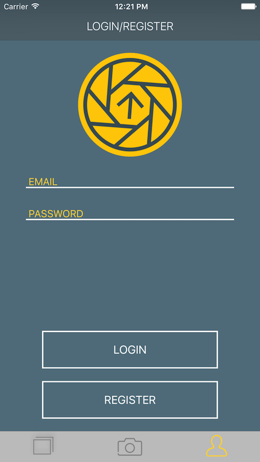
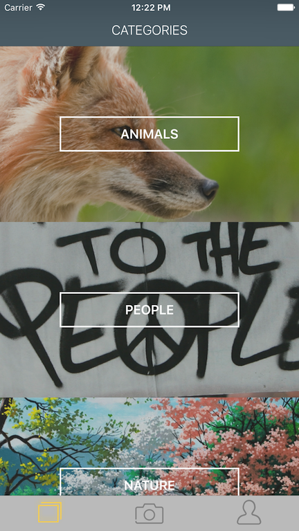
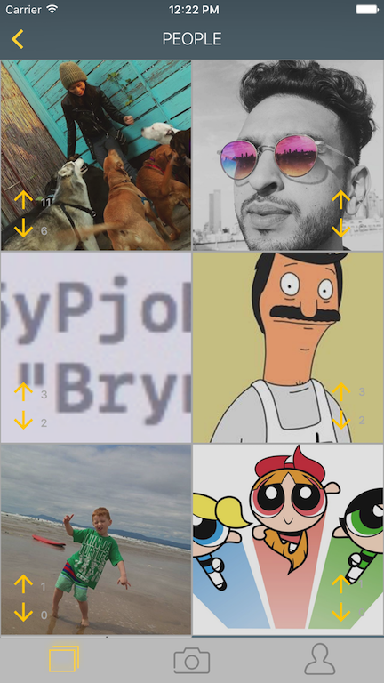
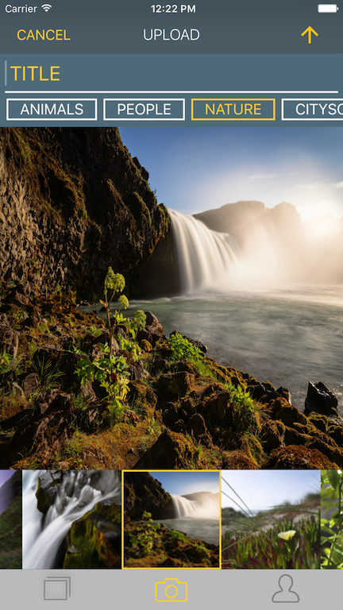
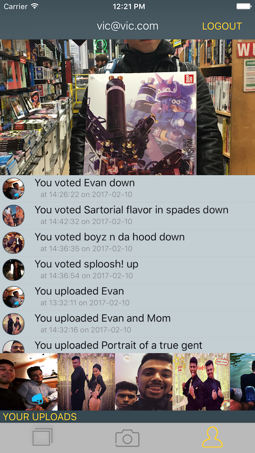

# AC3.2-U6-InstaClone

By Revolution No. 6, in first name order:

**Liam Kane:** [Github](https://github.com/liamdkane)

**Tom Seymour:** [Github](https://github.com/seymotom)

**Tong Lin:** [Github](https://github.com/TongLin91)

**Victor Zhong:** [Github](https://github.com/viczhong)

## Introduction

\[InstaClone\] is a social image sharing and upvoting app for the normal person sick to death of bloatware extraordinaire Instagram. Stricken with paralysis over a tsunami of hashtags? Annoyed by the myriad of Instagram "models"? Then InstaClone is for you!

Each new image is uploaded to one of a set of categories that you care about and is subsequently ranked by up- and down- votes within it. 

By funneling images into discrete categories more opportunites for each image to feature in a top-list.

## User flow

Launch Screen | Login | Categories
:---: | :---: | :---:
 |  | 
Logo shows up during launch | Register or Login, it's up to you | Category selection, each with animated images

See User Photos | Upload Your Own | User Profile
:---: | :---: | :---:
 |  | 
See everything that our users have uploaded | Share a photo with the rest of our users | See yourself and your activity

### Backend Services

The backend of the app is implemented in Firebase. 

* Registration and login uses Firebase's _Authentication_
* Structured data such as the pre-set list of categories, up- and down- votes use Firebase's _Database_
* Images are uploaded to Firebase's _Storage_

THIS IS MAGIC.

### Categories

For this MVP version of the app categories are defined and entered by an administrator 
within a node in the Firebase database and read into the app for use in any category 
related feature.

Users select among a pre-defined set of categories to  upload each image into. 

### Authentication

Registration and Login are reached from the same screen. Login is required in order to interact with voting and uploading.

### Profile

The profile page has a profile picture. This is chosen by tapping on the picture or a place-holder. 
The user is prompted to choose and upload a photo from the library. The user's up- and 	down- vote history
and a strip of your uploaded images, fetched from Firebase appear below the profile image.
 

##### Browsing

The Uploads tab is a custom photo browser built with the Photos framework. The data is
simply a reverse chronological list of all image assets in the user's library. Browsing is performed
by swiping either the main, large, image or the horizontally scrolling strip at bottom,
similar in operation to the built-in Photos app. Swiping above and scrolling below are kept in sync
with one another.

##### Uploading

When the user decides to upload an image, he/she chooses a category and gives it a title and
taps the upload button in the navigation bar. Progress and success (and failure) are reported.

